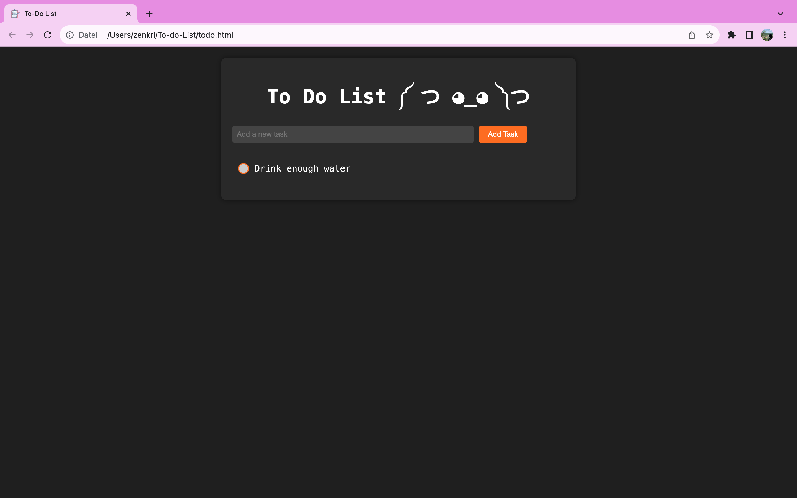

<p align="center">
  
</p>

<h1 align="center">To Do List ༼ つ ◕_◕ ༽つ <3 </h1>

<p align="center">
  <strong>A simple, minimalist To Do list web app to track your tasks and goals.</strong>
</p>

<p align="center">
  <a href="#technologies-used">Technologies Used</a> •
  <a href="#features">Features</a> •
  <a href="#how-to-use">How to Use</a> •
  <a href="#demo">Demo</a> •
 
</p>

## Technologies Used

- HTML5
- CSS3
- Vanilla JavaScript

## Features

- Easily add tasks with a goal marker.
- Mark tasks as completed with a visually satisfying circle indicator.
- Tasks automatically disappear upon completion, keeping your list tidy.

## How to Use

1. **Clone the repository**:

   ```bash
   git clone https://github.com/InesZenkri/To-do-List.git
   ```
2. Open`todo.html` in your preferred web browser.

3. Start organizing your tasks and achieving your goals! 

## Demo




You can download and watch the demo video by [clicking here](demo.mov).
