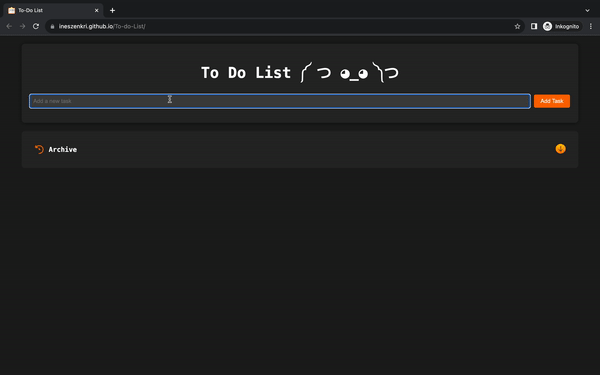

<p align="center">
  
</p>

<h1 align="center">To Do List ༼ つ ◕_◕ ༽つ <3 </h1>

<p align="center">
  <p>
  The To-Do List web application is your personal task manager designed to streamline your daily organization • ᴗ - </p>
</p>

<p align="center">
  <a href="#technologies-used">Technologies Used</a> •
  <a href="#features">Features</a> •
  <a href="#how-to-use">How to Use</a> •
  <a href="#demo">Demo</a> •
  <a href="#Acknowledgements">Acknowledgementso</a> •
  <a href="#License">License</a> •
 
</p>

## Technologies Used

- HTML5
- CSS3
- JavaScript

## Features

- Easily add, edit and delete tasks.
- Mark tasks as completed with a visually satisfying circle indicator.
- Tasks automatically disappear upon completion, keeping your list tidy.
- The tasks are stored in the browser's local storage, ensuring they persist across sessions.
- Click on the "History" button to view a list of completed tasks along with their timestamps.

## How to Use

1. **Clone the repository**:

      ``` bash
      git clone https://github.com/InesZenkri/To-do-List.git
      ```
  
   - Open`index.html` in your preferred web browser.

2. **Website :**

   - Or access the live version [here](https://ineszenkri.github.io/To-do-List/). 🚀
  
3. Start organizing your tasks and achieving your goals! 

## Demo





## Acknowledgements
- Icons made by [Freepik](https://www.freepik.com) from [www.flaticon.com](https://www.flaticon.com) 🎨

## Contributing
- Contributions are welcome ˶ᵔ ᵕ ᵔ˶ Feel free to [open issues](https://github.com/InesZenkri/To-do-List/issues) or submit pull requests. 🤝


## License

- This project is licensed under the [MIT License](LICENSE). 📜

